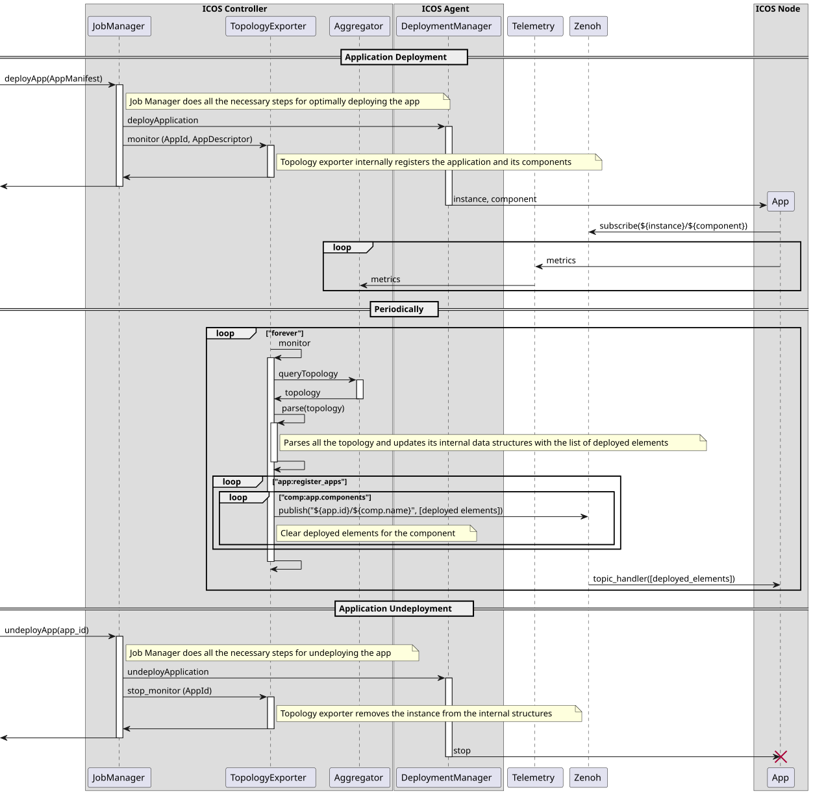

# Topology Exporter

This repository contains source code of the Topology Exporter component for the Meta-kernel layer of the ICOS project. The purpose of this component is to notify application-level containers about events related to the deployment of the application. Thus, application components can react to those events and change their configuration. This is especially needed for distributed computing libraries with no automatic resource discovery.

## Repository organization

The repository contains the following files and directories:

- `chart/`: files describing the Helm Chart of the component.
- `docs/`: files for building the documentation of the component.
- `src/`: source code of the component.
- `tests/`: source code, configuration files and scripts necessary to create a deployment that allows to validate the behaviour of the component.
- `Dockerfile`: instructions to build a docker image of the component.
- `LICENSE`: conditions to use, change and distribute the software included in this repository.
- `README.md`: this guide.

Find further information regarding the source code and the testing process in the `README.md` files within the corresponding folder.

## Service deployment

You can use Docker to run the service. Follow these commands:

```bash
docker build -t icos/topology-exporter .
docker run -p 80:80 icos/topology-exporter
```

This will build a Docker image tagged as *topology-exporter* and run a container with the component.

The container offers several environment variables to configure the component general setup:

- **ZENOH_EP**: Zenoh endpoint where to publish the topology of the applications.  
*Default*: `tcp/zenoh-local.default:7447`
- **AGG_URL**: Aggregator address where to query topology data.  
*Default*: `http://10.160.3.20:30400`
- **INTERVAL**: time lapse in seconds between topology updates.  
*Default*: `10`
- **AUTH_ENABLED**: enable authentication and authorizarion.  
*Default*: `True`

When authentication and authorizarion are enabled, other environment variables come into play:

- **ICOS_CERT**: relative path of the ICOS CA root certificate.  
*Default*: `icos-certificate.crt`
- **PERM_REGISTER**: permission scope for registering and unregistering application monitorization.  
*Default*: `app#Register`
- **PERM_READ**: permission scope for listing current monitoring applications.  
*Default*: `app#Read`
- **IAM_URL**: Keycloak server address where to validate tokens and check their permissions.  
*Default*: `https://iam.core.icos-staging.10-160-3-151.sslip.io`
- **IAM_REALM**: Keycloak realm name.  
*Default*: `staging-continuum`
- **IAM_ID**: Keycloak client identificator.  
*Default*: `contrl-1.topology-exporter`
- **IAM_SECRET**: Keycloak secret key.  
*Default*: `ZTTtUaZzoaIDhiML3qRGJ0YkOP0FeFCi`

## REST API

### Healthcheck

- **Path**: `/`
- **Method**: GET

### Start monitoring application

- **Path**: `/applications/{app_instance_id}`
- **Method**: PUT
- **Payload**: application descriptor

### Stop monitoring application

- **Path**: `/applications/{app_instance_id}`
- **Method**: DELETE

### List monitored applications

- **Path**: `/applications`
- **Method**: GET

## ICOS integration

Sequence diagram showing the behaviour of the Topology Exporter component inside the Meta-kernel layer of the ICOS project:



# Legal

The Topology Exporter is released under the Apache 2.0 license.
Copyright © 2022-2025 Barcelona Supercomputing Center (BSC). All rights reserved.

🇪🇺 This work has received funding from the European Union's HORIZON research and innovation programme under grant agreement No. 101070177.